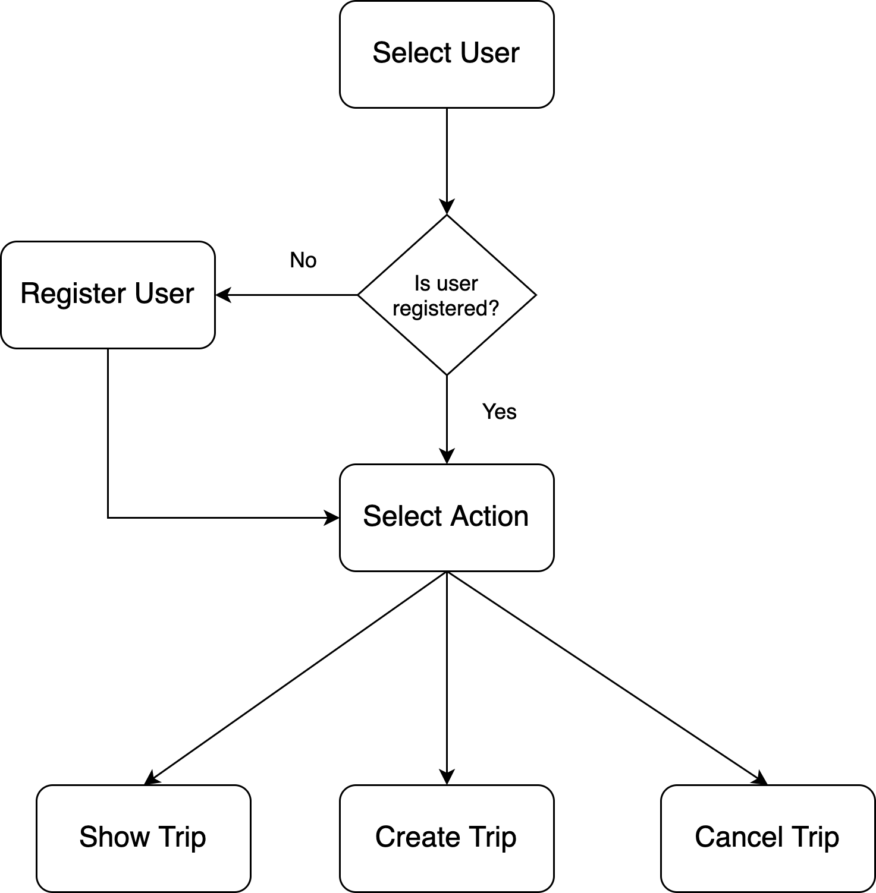

# Homework (Week 3)

## Domain model

You are creating a demo application for your new customer who provides different
services for the local travelers. They want you to build an CLI application for
their administrators.

This is mock application, so we are going to use in memory data store.

 
 
 If something goes wrong during the interaction flow application should
 handle this and retry a step or whole flow.
 
 Domain model MUST include next entities:
 
 1. User:
    - User Id
    - First Name
    - Second Name
    - Age
    - Location
    - Birthday
    - Email
 2. Hotel:
    - Hotel Id
    - Hotel Name
    - Location
 3. Trip
    - Trip Id
    - Hotel
    - Checkin Date
    - Checkout Date
    - Price
    - Duration
    - User
    - Status (Created, Processing, Done)
    
You may consider that some of these fields are optional to
reduce the complexity of the application.

## Services

### Show Trip

Must display trip description by trip id and/or user id or user name.

### Cancel Trip

Must delete and cancel a trip by trip id and or user id or user name.

### Create Trip

This should be an iterative process. One checkout/hotel should be added to
trip at one time.

Optionally after each iteration you should display list of the hotels.

## CLI (Advanced Task)

The application should support following operations:

 - users ls
 - users get --id=<id>
 - users get --first-name=$first --second-name=$second
 - users put --first-name=$first ...
 - hotels ls
 - hotels put --hotel-name=$name ...
 - trips ls
 - trips get --id=$id
 - trips put --user-id=$id ...
 - trips delete --id=$id ...

## Infrastructure

Everything should be back by YOUR implementation of Linked List 
(ua.kpi.ipt.hw.infra.impl.LinkedList).

